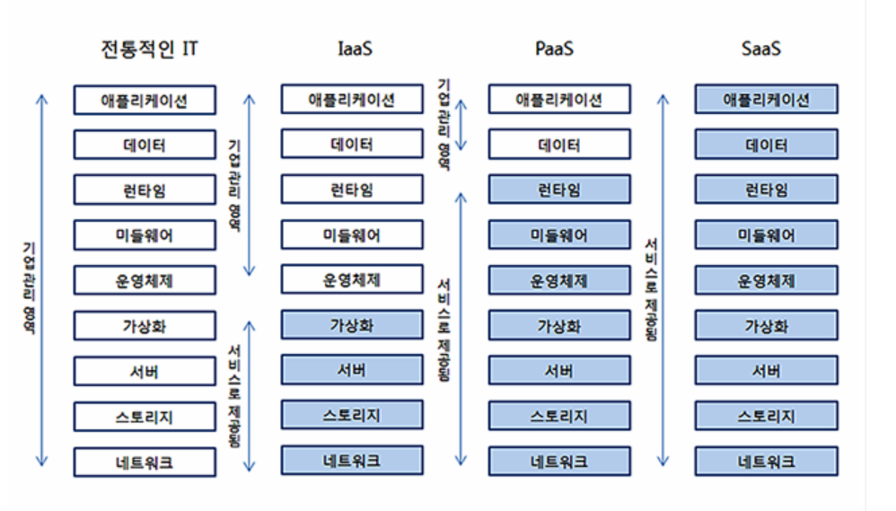

# 클라우드 #1: 가상머신(virtual machine)
## 전통적 배포방식 
: 물리적인 컴퓨터 한 대에 하나의 OS를 깔고 여러 거지 프로그램을 설치하는 방식. 
* 계정을 나눠 여러명의 사용자가 이용할 수 있도록 할 수 있지만 어떤 프로그램을 설치했을 때 다른 앱에 영향을 미침
## 가상화 배포방식 
: 가상머신을 기반으로 배포하는 것.
* 가상머신 
: 컴퓨터의 하드웨어를 소프트웨어적으로 구현한 것을 말함
* 한 대의 컴퓨터를 가지고 여러 개의 OS를 구동할 수 있게 되며, 하드웨어(CPU, RAM)을 물리적으로 갈아끼우는 것이 아니라 설정만으로 이를 수행할 수 있음
* 하이퍼바이저(hypervisor) 
: 하나의 시스템 상에서 가상의 컴퓨터를 여러개 구동할 수 있도록 해주는 중간 계층
* 하드웨어 위, 하이퍼바이저 위, 가상 머신
* 가상화 기술 때문에 한대의 하드웨어로 여러명의 사용자들에게 독립적으로 클라우드 서비스를 제공할 수 있음
    * 단점: 가상머신 위에 일일이 OS 설치 필요
# 클라우드 #2: 오프프레미스(off-premise)와 온프레미스(on-premise)
## 오프프레미스 방식
: 클라우드
* 내가 아닌 다른 회사의 공급자가 호스팅하고 인터넷을 통해 사용자에게 제공되는 인프라, 플랫폼 또는 소프트웨어
* 자체 인프라나 하드웨어 설치 없이 어플리케이션과 리소스를 쉽고 싸게 이용 가능
* AWS, 네이버 클라우드
* SK C&C 데이터 센터 화재: https://terms.naver.com/entry.naver?docId=6636183&cid=43667&categoryId=43667
## 온프레미스
* 네트워크 선을 설치하는 것부터 시작해 서버, 데이터베이스 설치 등을 하는 것.
* 자체 IDC == 온프레미스
    * 온프레미스: https://terms.naver.com/entry.naver?docId=6649731&cid=42346&categoryId=42346
    * 데이터센터: https://terms.naver.com/entry.naver?docId=3580629&cid=59088&categoryId=59096
    * 네이버 데이터 센터 각: https://datacenter.navercorp.com/
# 클라우드 #3: IassS와 PaaS와 SaaS
## IaaS
: Infrastruction as a Service(인프라형 클라우드 서비스)
* 클라우드가 인프라(데이터 저장공간과 서버)만을 제공함
* 필요한 소프트웨어를 개발자가 직접 설치해야 하는 대신 특정 서비스에 종속되지 않음
* ex) AWS의 EC2, NCP
* 넷플릭스가 모든 서비스를 아마존웹서비스(AWS)에서 운영
* 빈 방
## PaaS
: Platform as a Service(플랫폼형 클라우드 서비스)
* 소프트웨어가 미리 설치되어있고, 간단한 클릭을 통해 해당 서비스 이용 가능
* 모니터링, CI/CD 제공
* 제공되는 서비스가 종속적임
* 빌트인 방
* heroku: https://www.heroku.com/home
## SaaS
: Software as a Service(서비스형 클라우드 서비스)
* 완전한 서비스를 클라우드 서비스로부터 제공받아 사용
* ex) google docs

||IaaS|PaaS|
|---|---|---|
|유연성|높음|낮음|
|이식성|높음|낮음|
|운영비 효율|낮음|높음|

* 클라우드 서비스: https://terms.naver.com/entry.naver?docId=3580686&cid=59088&categoryId=59096

